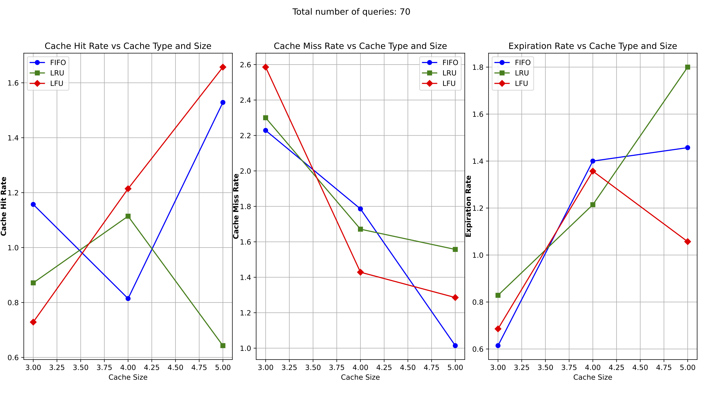

<a id="readme-top"></a>

<!-- PROJECT LOGO -->
<br />
<div align="center">
  <a href="https://github.com/EdoardoAllegrini/CacheCloudNet">
    
  </a>

  <h3 align="center">CacheCloudNet</h3>

  <p align="center">
    CacheCloudNet is an IoT network architecture leveraging balloons and drones for efficient data caching and relay, designed to enhance sensor-based data collection in dynamic environments using advanced caching strategies like FIFO, LFU, and LRU.
    <br />

  </p>
</div>


<!-- TABLE OF CONTENTS -->
<details open>
  <summary>Table of Contents</summary>
  <ol>
    <li>
      <a href="#about-the-project">About The Project</a>
      <ul>
        <li><a href="#built-with">Built With</a></li>
      </ul>
    </li>
    <li>
      <a href="#getting-started">Getting Started</a>
      <ul>
        <li><a href="#prerequisites">Prerequisites</a></li>
        <li><a href="#installation">Installation</a></li>
      </ul>
    </li>
    <li><a href="#usage">Usage</a></li>
    <li><a href="#contributing">Contributing</a></li>
    <li><a href="#license">License</a></li>
    <li><a href="#contact">Contact</a></li>
  </ol>
</details>


<!-- ABOUT THE PROJECT -->
## About The Project

For the detailed description of this project refer to the [Report](/CacheCloudNet__IoT___public_repo_.pdf) file.

CacheCloudNet is an innovative IoT network architecture simulator aiming to improve data reliability and communication efficiency in environments with mobile sensors. This project serves as a simulation of a network composed by mobile balloons and drones to provide caching and relay services, ensuring seamless data transmission to a central base station. The balloons act as edge servers with limited storage and employ intelligent caching strategies (FIFO, LFU, LRU) to manage sensor data dynamically.

Key features of the project include:

- **Efficient Data Caching**: Using advanced caching techniques to optimize storage and retrieval.
- **Dynamic Sensor Management**: Automating sensor deployment and movement to ensure maximum coverage.
- **Performance Testing**: Evaluation of different cache replacement policies through simulations.

CacheCloudNet is designed to handle real-world IoT challenges such as intermittent connectivity, storage limitations, and fluctuating sensor data requests.

<p align="right">(<a href="#readme-top">back to top</a>)</p>


<div style="display: flex; justify-content: space-around;">

  

</div>

<hr>

<div style="display: flex; justify-content: space-around;">

  

</div>

### Built With

- [![Python][Python.org]][Python-url] 
- [](https://index.ros.org/doc/ros2/)
- [](http://gazebosim.org/)

<p align="right">(<a href="#readme-top">back to top</a>)</p>


<!-- GETTING STARTED -->
## Getting Started

### Prerequisites

* python3
* ros2
* gazebo


### Installation


1. **Clone the Repository**:
```bash
git clone https://github.com/EdoardoAllegrini/CacheCloudNet.git
cd CacheCloudNet
```
2. **Install Dependencies**: Ensure that Python 3.x and ROS 2 are installed. Install the required Python dependencies:
```bash
pip install -r requirements.txt
```


<p align="right">(<a href="#readme-top">back to top</a>)</p>


<!-- USAGE EXAMPLES -->
## Usage

1. **Building the project**: 
```bash
colcon build
```
2. **Running the Simulation**: The parameters specified after ':=' can be changed as desired:
```bash
source ./install/local_setup.bash
ros2 launch project_main main.launch.py balloons:=4 sensors:=4 sensors_range:=20 bs_outside:=1 cache_type:=FIFO cache_size:=3 cache_expiration:=5 query_rate:=4
```

<p align="right">(<a href="#readme-top">back to top</a>)</p>


<!-- CONTRIBUTING -->
## Contributing

Contributions are what make the open source community such an amazing place to learn, inspire, and create. Any contributions you make are **greatly appreciated**.

If you have a suggestion that would make this better, please fork the repo and create a pull request. You can also simply open an issue with the tag "enhancement".
Don't forget to give the project a star! Thanks again!

1. Fork the Project
2. Create your Feature Branch (`git checkout -b feature/AmazingFeature`)
3. Commit your Changes (`git commit -m 'Add some AmazingFeature'`)
4. Push to the Branch (`git push origin feature/AmazingFeature`)
5. Open a Pull Request

<p align="right">(<a href="#readme-top">back to top</a>)</p>


<!-- LICENSE -->
## License

See [LICENSE](LICENSE) for more information.

<p align="right">(<a href="#readme-top">back to top</a>)</p>


<!-- CONTACT -->
## Contact

Edoardo Allegrini - [website](https://EdoardoAllegrini.github.io)
<br>
Project Link: [https://github.com/EdoardoAllegrini/CacheCloudNet](https://github.com/EdoardoAllegrini/CacheCloudNet)

<p align="right">(<a href="#readme-top">back to top</a>)</p>


<!-- MARKDOWN LINKS & IMAGES -->
<!-- https://www.markdownguide.org/basic-syntax/#reference-style-links -->
[repo-url]: https://github.com/EdoardoAllegrini/CacheCloudNet
[Python-url]: https://www.python.org
[Python.org]: https://img.shields.io/badge/Python-3776AB?style=for-the-badge&logo=python&logoColor=white

[ROS2-url]: https://index.ros.org/doc/ros2/
[ROS2-logo]: https://img.shields.io/badge/ROS2-22314E?style=flat&logo=ros&logoColor=white

[Gazebo-url]: http://gazebosim.org/
[Gazebo-logo]: https://img.shields.io/badge/Gazebo-0C2A29?style=flat&logo=gazebo&logoColor=white